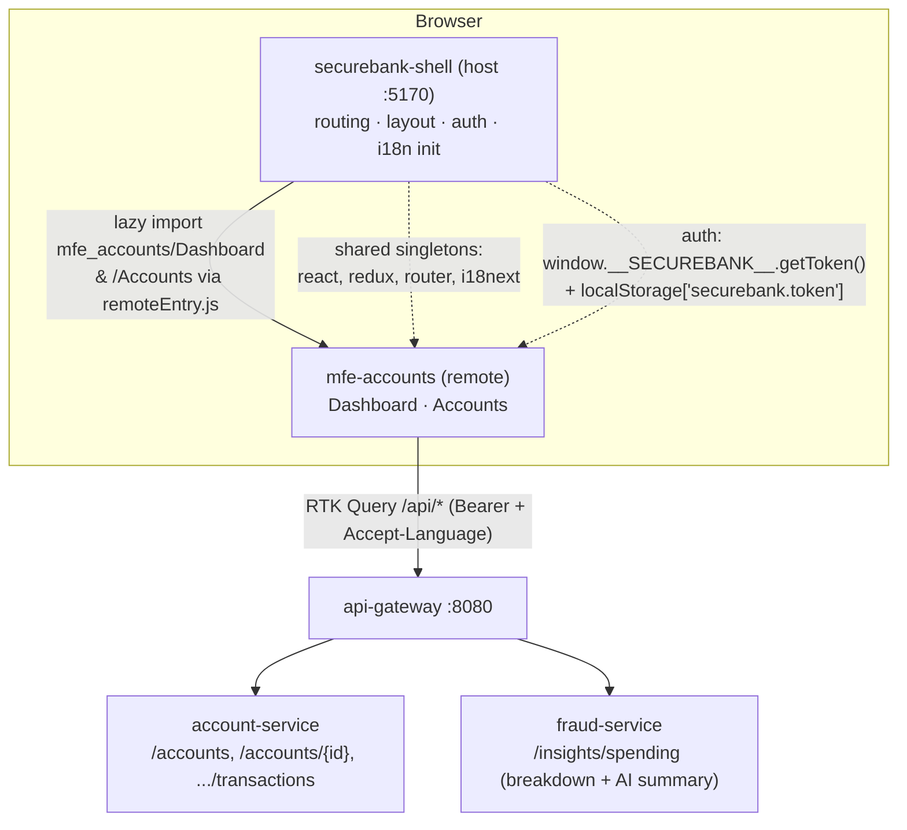

# mfe-accounts — Architecture & Remote Contract

`securebank-mfe-accounts` is a **Module Federation remote**. It does not own routing, layout,
auth, or i18n initialization — the **shell** (host) does. This MFE simply exposes two React
screens and knows how to fetch its own data from the gateway, reusing the shell's auth.

## What it exposes

| Import path (from the shell) | Component | Backs onto |
|---|---|---|
| `mfe_accounts/Dashboard` | Dashboard | `GET /api/accounts`, `GET /api/insights/spending` |
| `mfe_accounts/Accounts`  | Accounts (list → detail, open-account dialog) | `GET /api/accounts`, `GET /api/accounts/{id}`, `GET /api/accounts/{id}/transactions`, `POST /api/accounts` |

Each exposed module's **default export** is a self-contained React component. They assume the
surrounding `<Provider>` (Redux), i18n instance and router come from whoever mounts them.

## Federation configuration

```
name:     mfe_accounts
filename: remoteEntry.js
target:   esnext
exposes:  ./Dashboard, ./Accounts
shared (singletons): react, react-dom, react-router-dom, react-i18next, i18next,
                     @reduxjs/toolkit, react-redux
```

The shell adds us to its `remotes` map, for example:

```ts
// in securebank-shell vite.config.ts
federation({
  name: "shell",
  remotes: { mfe_accounts: "http://localhost:5171/assets/remoteEntry.js" },
  shared: ["react", "react-dom", "react-router-dom", "react-i18next", "i18next",
           "@reduxjs/toolkit", "react-redux"],
});
```

and lazy-loads a screen:

```tsx
const Dashboard = React.lazy(() => import("mfe_accounts/Dashboard"));
```

### Why singletons matter

React context only works if there is **one** React. Two copies would each keep their own
context registry, so the shell's `<Provider>`, i18n `<I18nextProvider>` and `<BrowserRouter>`
would be invisible to the remote and hooks (`useSelector`, `useTranslation`, `useNavigate`)
would throw. Declaring these packages as singletons makes the remote reuse the shell's
already-loaded instances.

## Auth: standalone vs embedded

The data layer (`src/api/accountsApi.ts`) never stores the token in its own Redux state.
Instead `prepareHeaders` resolves it **per request** via `src/lib/auth.ts`:

```
readAccessToken():
  1. window.__SECUREBANK__?.getToken?.()      ← embedded fast path (shell's live token)
  2. localStorage["securebank.token"]          ← durable shared key (standalone + fallback)
```

This is the single coupling point with the shell. Both sides agree on:

- the localStorage key `securebank.token`, and
- (optionally) the `window.__SECUREBANK__.getToken()` bridge.

`Accept-Language` is set from the live `i18next.language`, so a language switch in the shell
immediately changes the backend's localized AI summary.

### Standalone mode (`:5171`)

- Own Redux store (`src/store.ts`) holds the `accountsApi` slice.
- Own i18n init (`src/i18n/index.ts`) — only initializes if i18n isn't already initialized.
- Own router + dev harness top bar (`src/DevHarness.tsx`) with a language switcher and a
  "paste JWT" button that writes `securebank.token`.
- Vite proxies `/api` → `http://localhost:8080`.

### Embedded mode (inside the shell)

- The shell supplies store, i18n and router (shared singletons).
- `initAccountsI18n()` detects an already-initialized i18n and only **merges** our translation
  bundles (it never re-inits, which would clobber the shell's language).
- The shell's origin serves `/api`; the relative `baseUrl: "/api"` needs no change.

## Diagram



## Source tree

```
src/
  api/
    accountsApi.ts     RTK Query slice (4 GET + 1 POST), auth + Accept-Language headers
    types.ts           wire types mirroring backend DTOs
  components/
    ui/                shadcn primitives: card, button, badge, skeleton, table, dialog
    StateViews.tsx     reusable loading / error / empty states
  exposes/
    Dashboard.tsx      FEDERATION expose -> default <Dashboard/>
    Accounts.tsx       FEDERATION expose -> default <Accounts/>
  features/
    dashboard/
      Dashboard.tsx    balance cards, insights donut, AI summary
      SpendingChart.tsx recharts donut (themed via CSS vars)
    accounts/
      Accounts.tsx     list <-> detail view + open-account button
      AccountDetail.tsx transactions table
      OpenAccountDialog.tsx  POST /api/accounts dialog
  i18n/
    index.ts           init-or-merge i18n (embedded-safe)
    locales/{en,hi,mr}.json   real Devanagari for hi/mr
  lib/
    auth.ts            STANDALONE-VS-EMBEDDED auth contract
    money.ts           Intl.NumberFormat money/percent by locale+currency
    utils.ts           cn() class merge
  store.ts             standalone Redux store
  bootstrap.tsx        standalone mount (store + i18n + router + harness)
  main.tsx             dynamic import("./bootstrap") (federation init order)
  DevHarness.tsx       standalone dev top bar + routes
  index.css            SecureBank design tokens (mirrors shell)
```
